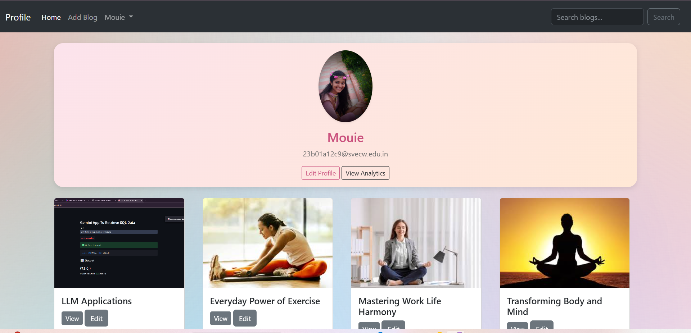

📝 Blogging Application(Node.js + Express +MySQL): 

This is a full-stack Blogging Application built using Node.js, Express.js, EJS, MySQL, and Multer. The app allows users to create, read, update, and delete blog posts with support for image uploads, commenting, and categorization.

🔧 Features:
-> User Authentication (Signup/Login)

-> Create & Edit Blogs with image support

-> Categorize Blogs by topics

-> Comment System on each blog post

-> Blog List View with featured thumbnails and summaries

-> User Dashboard to manage personal posts

-> Multer for secure image uploads

-> MySQL Database integration for data persistence

-> EJS Templating Engine for server-side rendering

-> (Optional) Analytics & Views Tracking

🛠️ Tech Stack:
Backend: Node.js, Express.js

Frontend: EJS, Bootstrap (or any preferred CSS)

Database: MySQL

File Uploads: Multer

Authentication: Express-session 

How to Run:

git clone https://github.com/your-username/blog-app.git
cd blog-app
npm install
node app.js

